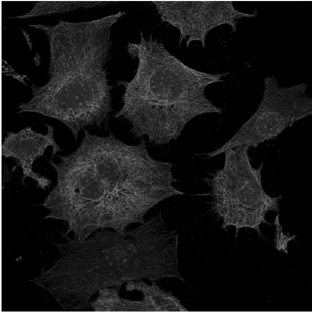
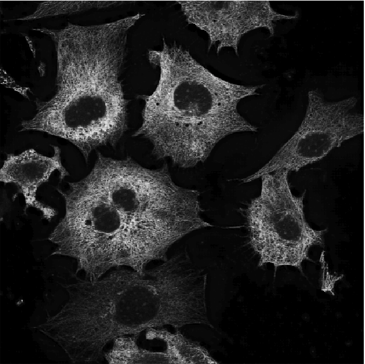
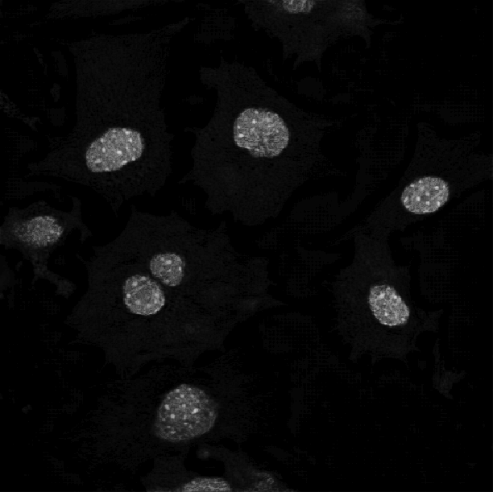
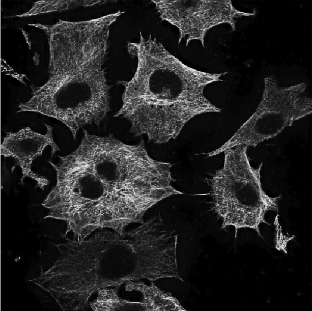
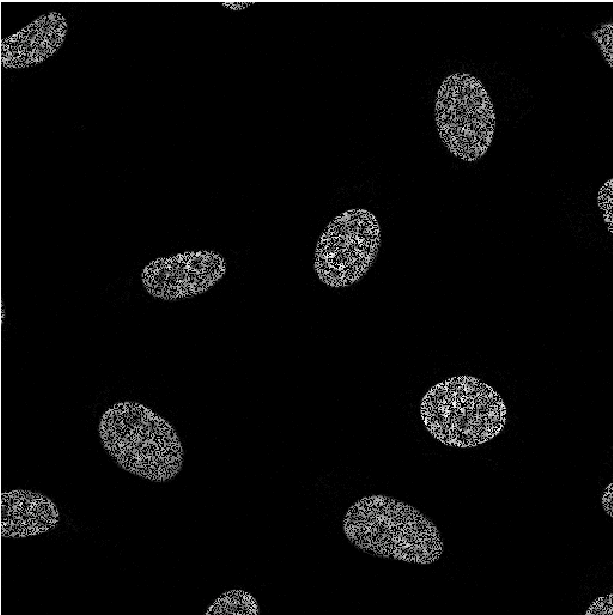
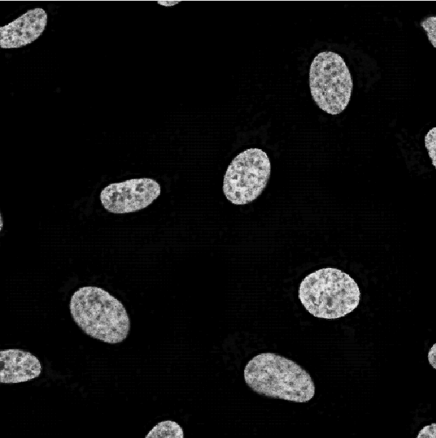

# Cell Segmentation

PyTorch implementation of several neural network segmentaion models (UNet, FusionNet, DialatedConvolution) for cell image segmentation. The trained models from this repository are used for the segmentation plugin [segmentify](https://github.com/transformify-plugins/segmentify) for [Napari](https://github.com/napari/napari)

| Original | Segmentation |
| --- | --- |
|  |  |

## Dataset

The following datasets were used to train and test the different cell segmentatoin models:

- [Nuclei Dataset](https://www.kaggle.com/c/data-science-bowl-2018/overview)

- [HPA Dataset](https://www.kaggle.com/c/human-protein-atlas-image-classification)

- [Nuero Dataset](http://neurofinder.codeneuro.org/)


## Process Data

After downloading the dataset from the links above, each dataset can be parsed and converted to a HDF5 file using scripts from *./process_data*. For example:

```python ./process_data/hpa_create_hdf5.py --input_dir PATH_TO_DATA --output_dir PATH_TO_OUTPUT```

Example script can be found at *./process_data/create_hdf5.sh*


## Segmentation Models:
This repository includes several simple segmentation networks, including:

- [UNet](https://arxiv.org/abs/1505.04597)
- [FusionNet](https://arxiv.org/pdf/1612.05360.pdf)
- [Dialated Convolution](https://arxiv.org/abs/1511.07122)


## Training Modes
The same segmentation models can be trained for a wide range of tasks. These different training procedures are done by altering the output target for the training data, as implemented in the *./dataset* folder. 

### Simple Neuclei Segmentation

As expected, these segmentation models can be used for simple segmentation tasks such as segmenting out the Cell's nuclei:

| Dataset | Original | Segmentation |
| --- | :---: | :---: |
| Neuro |  |  |
| Nuclei |  |  | 

The above simple nuclei segmentation can be trained by running *train.py* and set the dataset argument to **nuclei** or **neuron**.


### Cell Components Segmentation

The segmentation models can also be used to simultaniously decompose microscopy images of cells into it's cellular structures, such as Nucleus, Microtubules and ER: 

| Original | ER | Nucleus | Microtubules | 
| --- | --- | --- | --- |
|  |  |  |  |

The above cell structure decomposition model can be trained by running *train.py* and set the dataset argument to **hpa** as well as the desired target channels (e.g **0,2,3**). 


### Image Restoration

The segmentation models can also be used to restore missing pixels in an image:

| Original | Restoration | Ground Truth | 
| --- | --- | --- |
|  |  |  |

The above missing pixels restoration model can be trained by running *train.py* and set the dataset argument to **hpa_single**. 


## Train Model 

To train any models, run the *train.py* with the desired configurations. Example configurations for each training modes can be found in the *train_\*.sh* files. The output trained model will be based on the **experiment_name** parameter. 


### Tensorboard 

You can visualize the trianing loss and IoU during training, as well as the segmentation images, using Tensorboard. While the model is training, run ```tensorboard --logdir=logs --port=1234``` and your Tensorboard can be opened in your browser with the link **http://localhost:1234**
